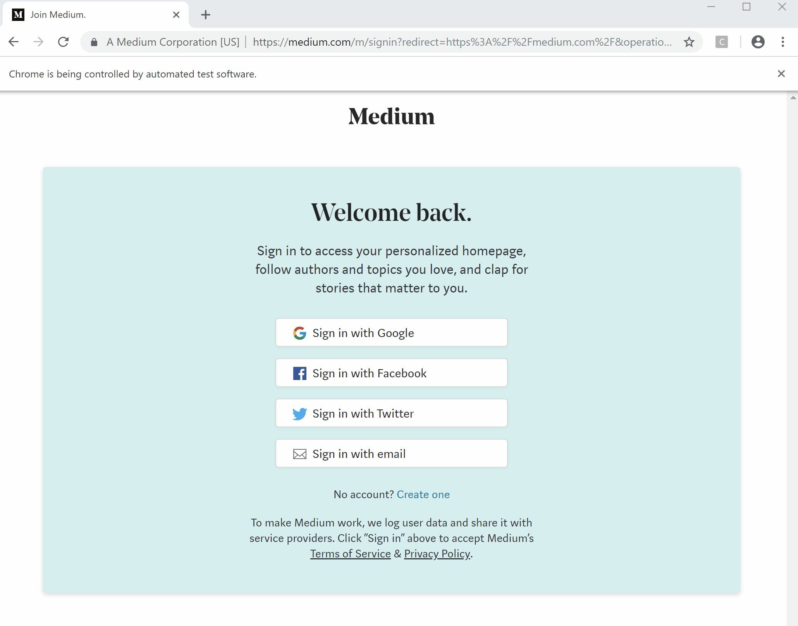

# Medium Profile Stats
Get statistics on views and reads on Medium article. Data can be used to perform a time-series analysis on reads/views of an article written on Medium, or statistical analysis (e.g. regression analysis) on views VS actual reads. 

## Project Highlights
- Google sign-in with *Python*
- Web scraping with *Python*

## Code Summary
- initialize webdriver
- go to Medium sign-in page with link
- click on "Google Sign-In" option
- input username (Gmail address) + click "Next" to go to password
- input password + click "Next" to sign-in
- get view + reads data for last "n" months
- create schema for data and save to Excel

## Packages
- time : delay code execution; https://docs.python.org/3/library/time.html
- selenium : web driver; automate navigation on pages; https://pypi.org/project/selenium/
- bs4 : parse HTML page content; https://pypi.org/project/beautifulsoup4/
- pandas : create data schema; https://pandas.pydata.org/
- datetime : convert to time format; https://docs.python.org/2/library/datetime.html
- calendar : to get day of week; https://docs.python.org/2/library/calendar.html#module-calendar

## Scraping Snippet
> the gif below shows the navigation with Selenium web driver (steps are in code)

